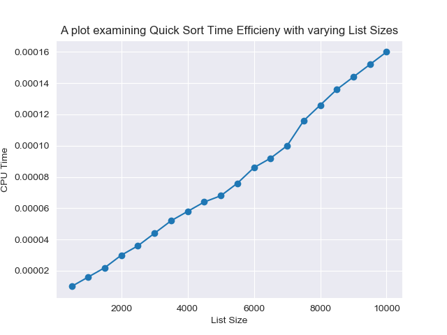

# Introduction to Time-Complexity of Sorting Algorithms #

## Bubble Sort ##

Bubble sort is a simple sorting algorithm that works by repeatedly swapping adjacent pairs of values until a list is sorted.

On average, the bubble sort has a complexity of $O(n^2)$. In an array of length $n$ there are $n-1$ comparisons. In 'big O' notation, this means that there are $O(n)$ comparisons.

Because there are n elements in the array, iterating over the array has a complexity of $O(n)$.

A $O(n)$ operation over a $O(n)$ sized list leads to a complexity of $O(n) \cdot O(n)$ or $O(n^2)$.

### Bubble Sort Code ###

```python
import random as rn

def bubbleSort(arr):
    n = len(arr)
    for i in range(n):
        for j in range(0, n-i-1):
            if arr[j] > arr[j+1] :
                arr[j], arr[j+1] = arr[j+1], arr[j]

rnd_order= rn.sample(range(1, 501), 500)

bubbleSort(rnd_order)
```

Below is a graph of the process time against list size:


### Optimising Bubble Sort ###

It is possible to optimise the bubble sort algorithm after you note that the n-th pass places the n-th elemennt in the correct position. Thus we can avoid looking at the $n-1$ element on the $n+1$ pass. In code, we can redefine $n$ as $n-1$ in each loop.

This is more clear after watching the GIF below, after the first pass, 8 is in the correct position and thus does not need to be sorted again.

#### Bubble Sort Gif ####


This leads to the algorithm being almost twice as fast!


## Merge Sort ##

Merge Sort is more conceptually complex than a bubble sort.

An unsorted list is divided into sublists of 1 element. These sublists are then repeatedly sorted and merged until there is only one sublist remaining. This sublist will be the sorted list.

As above, a gif is a nice way to visualise this:


<span style="font-size:2px">Source: Swfung8 [CC BY-SA 3.0 (https://creativecommons.org/licenses/by-sa/3.0)]<span>

### Merge Sort Time Complexity ###

## Quick Sort ##

The times for quick sort:

